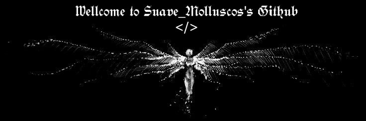

  

  

<h2 align="center">🜁 SOBRE MI 🜁</h2>

 

    Hola, <em><b>soy Suave</em></b>, desarrollador backend con enfoque en soluciones robustas y eficientes. 
    Trabajo con Python, C++ y PostgreSQL, y disfruto diseñar sistemas que resuelvan problemas reales 
    con lógica limpia. Siempre estoy abierto a colaborar en proyectos interesantes y a nuevas oportunidades.

 
 
 
<h2 align="center">λ Tecnologías λ</h2>

  
  
  
  
  
  
  
  
  
  

